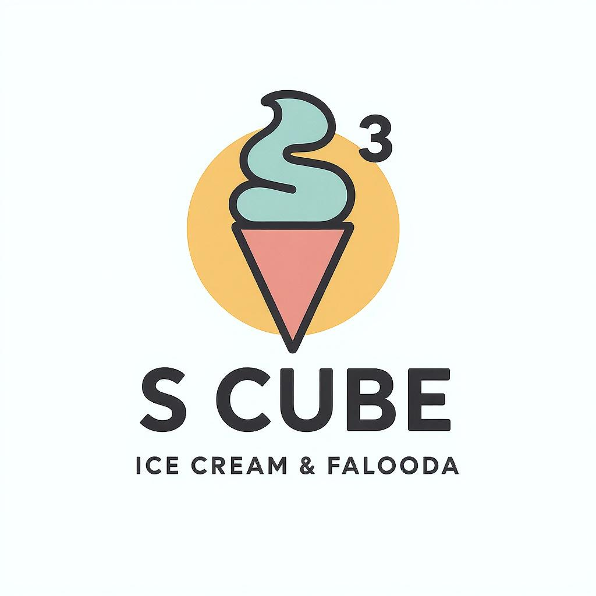

# S Cube Ice Cream Menu

A responsive, modern, and visually appealing digital menu for S Cube Ice Cream & Falooda shop. This single-page website showcases the shop's variety of ice cream flavors, faloodas, milkshakes, and kulfis with an attractive layout and interactive elements.



## Features

- **Responsive Design**: Adapts perfectly to all device sizes (mobile, tablet, desktop)
- **Modern UI**: Visually appealing design with animations and decorative elements
- **Menu Categories**: 
  - Classic and Exotic Faloodas
  - Bombay Special Faloodas
  - Ice Cream Scoops
  - Kulfis
  - Milkshakes
- **Social Media Integration**: Instagram feed embedded in the page
- **Location Information**: Google Maps integration with directions
- **Animated Elements**: Floating decorative elements and smooth transitions
- **Accessibility**: Focus states and semantic markup for better accessibility

## Technologies Used

- HTML5
- CSS3 (with animations and responsive design)
- JavaScript (for interactive elements)
- Google Fonts (Cherry Bomb One, Fredoka)
- Instagram Embed API
- Google Maps Embed API

## Design Features

- Curved decorative elements
- Gradient backgrounds
- Floating animation for decorative elements
- Custom-styled section titles and containers
- Mobile-friendly tappable areas
- Responsive typography with clamp() for fluid font sizes

## Files Included

- `index.html` - The main HTML file (copy of ice_cream_menu.html for web hosting)
- `ice_cream_menu.html` - Original HTML file
- `vercel.json` - Configuration for Vercel deployment
- `/images/` directory containing:
  - `logo.png` - S Cube logo (renamed from image(7).png)
  - `coffee-machine.png` - Decorative element
  - `falooda-glass.png` - Decorative element
  - `ice-cream-shop.png` - Decorative element
  - `ice-cream-sundae.png` - Decorative element
  - `milkshake.png` - Decorative element
  - `purple-ice-cream.png` - Decorative element
  - `Magic-Box.gif` - Animated icon for the parcel note
  - `gift-icon.png` - Gift icon

## Installation

Simply clone this repository and open `ice_cream_menu.html` in any modern web browser:

```bash
git clone https://github.com/YOUR_USERNAME/s-cube-ice-cream-menu.git
cd s-cube-ice-cream-menu
```

## Deployment

The website can be deployed on any static web hosting service such as GitHub Pages, Netlify, or Vercel.

### Deploying to GitHub Pages

1. Push the repository to GitHub
2. Go to repository Settings
3. Navigate to Pages
4. Select the branch to deploy (usually main or master)
5. Save the settings
6. Your site will be published at `https://YOUR_USERNAME.github.io/s-cube-ice-cream-menu/`

### Deploying to Vercel (Recommended)

#### Option 1: Deploy via GitHub

This project is configured for optimal deployment on Vercel:

1. Sign up for a free account at [vercel.com](https://vercel.com)
2. Click "New Project" and select "Import Git Repository"
3. Connect your GitHub account and select the "S-cube-menu" repository
4. Keep the default settings (which will use our included `vercel.json` configuration)
5. Click "Deploy"
6. Your site will be published at a Vercel URL (e.g., `s-cube-menu.vercel.app`)

#### Option 2: Deploy directly with Vercel CLI

Deploy from your local machine without pushing to GitHub:

1. Install Node.js from [nodejs.org](https://nodejs.org/)
2. Install the Vercel CLI: `npm install -g vercel`
3. Log in to Vercel: `vercel login`
4. Navigate to your project directory and run: `vercel`
5. Follow the prompts to deploy your project
6. For production deployment, run: `vercel --prod`
7. Your site will be published at a Vercel URL (e.g., `s-cube.vercel.app`)

## Business Information

S Cube Ice Cream & Falooda is located at:
- 📍 86-A1, AMMA KOVIL MAIN STREET
- OPP VVHS SCHOOL
- PONNAMARAVATHI - 622407
- [Get Directions on Google Maps](https://goo.gl/maps/qLHQHzDu4un1mvoD7)

Follow on Instagram: [@s_cube_official_s3](https://www.instagram.com/s_cube_official_s3)

## License

This project is intended for S Cube Ice Cream & Falooda. Please contact the shop owners for permission before reusing any part of this code for commercial purposes.

## Credits

- Fonts from Google Fonts
- Social media integration via Instagram Embed API
- Location services via Google Maps Embed API

---

© S CUBE ICE CREAM & FALOODA